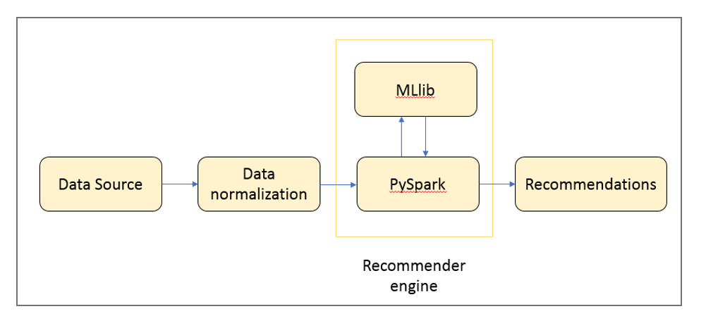

# Collaborative filtering Building a Book recommendation System using PySpark

### What is Recommender System
-	Recommender Systems are aimed to improve user experience by providing personalized recommendations.
-	It is a subclass of information filtering system that seeks to predict the "rating" or "preference" that a user would give to an item. 
 
### Why Recommender System
In the todays era of internet, where huge amount of data is being produced and collected so easily everyday through websites, smart phones, sensors, it has become very crucial to filter, prioritize and organize this data to extract useful information out of it.  Recommender Systems is one such solution that filters large volume of data and provides personalized contents and services.  

### Examples
-	Movie recommendation by Netflix
-	Product recommendation by Amazon
-	Job Recommendation by LinkedIn/Job portals

### Types of recommendation Systems
Recommender Systems can be implemented in three ways.
1.	Popularity based recommender system
-	Recommends most popular items
-	Drawback: Recommendations are not personalized
2.	Classification based model
-	Uses Classification algorithm to recommend items
-	Offers personalized recommendations
-	Drawback: Designing classifier becomes exponentially difficult as number of users and items increases.
3.	Using Recommendation Algorithms
-	There are two types of recommendation algorithms
1.	Content based
2.	Collaborative filtering
### Collaborative filtering
Collaborative filtering is the most commonly used algorithm for implementing recommendation system. 
### Installation 
We will be using PySpark to build the recommendation System.
Steps for installing PySpark on windows operating system are as follows.
#### 1. Installing Python
-	Go to python download page https://www.python.org/downloads/ and download latest   python 2 Windows x86-64 MSI installer.
-	Run the installer and select add python.exe to Path.
-	Check python installation by running following command in new Command Prompt window.
```sh
python --version
```

#### 2. Installing Java
-	Go to Java download link here
http://www.oracle.com/technetwork/java/javase/downloads/jdk8-downloads-2133151.html
-	Accept the license agreement and download the latest version of 64 bit Java SE Runtime Environment Installer for Windows.
-	Once the download is complete, run the installer and install Java.
-	To set up Java PATH in windows:
Go to Control panel  System and Security  System  Advanced system settings  Environment variables  System variables  Path  Add location of Java bin folder  OK
-	To check Java is properly installed on windows, open a new Command Prompt and type 
```sh
java -version
```

#### 3. Installing Apache Spark
-	Go to the Spark download page here http://spark.apache.org/downloads.html
-	Choose a Spark release: select the latest stable release of Spark.
-	Choose a package type: select a version that is pre-built for the latest version of Hadoop such as Pre-built for Hadoop 2.6.
-	For Choose a download type, select Direct Download.
-	Click the link next to Download Spark: spark-1.6.2-bin-hadoop2.6.tgz.
-	Unzip the .tgz file to install Spark
-	Set up environment variables as follows
SPARK_HOME C:\opt\spark\spark-2.1.0-bin-hadoop2.7
HADOOP_HOME C:\opt\spark\spark-2.1.0-bin-hadoop2.7
-	To run IPYTHON, set
PYSPARK_DRIVER_PYTHON ipython 
-	To check, if Spark installation is successful, type following command in new Command Prompt
```sh
cd C:\spark\spark-1.6.2-bin-hadoop2.6
bin\pyspark
```

### High – level Architecture of recommender System

 
### Code / How to run 
###Link for Book Crossings Dataset
Book Crossings dataset can be downloaded from the link below 
http://www2.informatik.uni-freiburg.de/~cziegler/BX/


BookCrossings – Dataset, Readme.md, .py, notebook
### Short Comings
