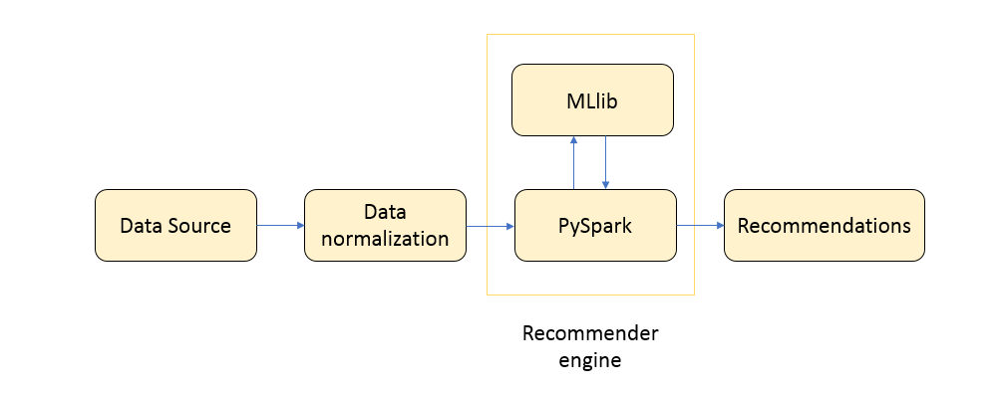

# Building a Book Recommendation System using collaborative filtering

### What is Recommender System?
-	Recommender Systems are aimed to improve user experience by providing personalized recommendations.
-	It is a subclass of information filtering system that seeks to predict the "rating" or "preference" that a user would give to an item. 
 
### Why Recommender System?
In the todays era of internet, where huge amount of data is being produced and collected so easily everyday through websites, smart phones, sensors, it has become very crucial to filter, prioritize and organize this data to extract useful information out of it.  Recommender Systems is one such solution that filters large volume of data and provides personalized contents and services.  

### Examples
-	Movie recommendations by Netflix
-	Product recommendations by Amazon
-	Job recommendations by LinkedIn/job portals

### Types of Recommender Systems
Recommender Systems can be implemented in three ways.
1.	Popularity based recommender system
-	Recommends most popular items.
-	Drawback: Recommendations are not personalized.

2.	Classification based recommender system
-	Uses classification algorithm to recommend items.
-	Offers personalized recommendations.
-	Drawback: Designing classifier becomes exponentially difficult as number of users and items increases.

3.	Using Recommendation Algorithms
-	There are two types of recommendation algorithms
1.	Content based
2.	Collaborative filtering

### Collaborative filtering
Collaborative filtering is the most commonly used algorithm for implementing recommendation system. In this project, I will be implementing recommender system using spark.mllib package which supports model based collaborative filtering. Spark.mllib describes users and products by latent factors which is used to predict missing entries. Alternating Least Square(ALS) algorithm is defined by spark to calculate latent factors.

### Installation 
We will be using PySpark to build the recommendation System.
Steps for installing PySpark on windows operating system are as follows.
#### 1. Installing Python
-	Go to python download page https://www.python.org/downloads/ and download latest   python 2 windows x86-64 MSI installer.
-	Run the installer and select ‘add python.exe to Path’.
-	Check python installation by running following command in new Command Prompt window.
```sh
python --version
```

#### 2. Installing Java
-	Go to Java download link here
http://www.oracle.com/technetwork/java/javase/downloads/jdk8-downloads-2133151.html
-	Accept the license agreement and download the latest version of   64 bit Java SE Runtime Environment Installer for Windows.
-	Once the download is complete, run the installer and install Java.
-	To set up Java PATH in windows:
Go to Control panel  System and Security  System  Advanced system settings  Environment variables  System variables  Path  Add location of Java bin folder  OK
-	To check Java is properly installed on windows, open a new Command Prompt and type 
```sh
java -version
```

#### 3. Installing Apache Spark
-	Go to the Spark download page here http://spark.apache.org/downloads.html
-	Choose a Spark release: select the latest stable release of Spark.
-	Choose a package type: select a version that is pre-built for the latest version of Hadoop such as Pre-built for Hadoop 2.6.
-	For Choose a download type, select Direct Download.
-	Click the link next to Download Spark: spark-1.6.2-bin-hadoop2.6.tgz.
-	Unzip the .tgz file to install Spark
-	Set up environment variables as follows
SPARK_HOME C:\opt\spark\spark-2.1.0-bin-hadoop2.7
HADOOP_HOME C:\opt\spark\spark-2.1.0-bin-hadoop2.7
-	To run IPYTHON, set
PYSPARK_DRIVER_PYTHON ipython 
-	To check, if Spark installation is successful, type following command in new Command Prompt
```sh
cd C:\spark\spark-1.6.2-bin-hadoop2.6
bin\pyspark
```

### High level Architecture of Recommender System


### Link for Book Crossings Dataset
Book Crossings dataset can be downloaded from the link below
 
http://www2.informatik.uni-freiburg.de/~cziegler/BX/

### How to run the code
Code for recommendation system is provided in IPython notebook. To run the code, please download the IPython notebook (RecommenderSystemBookCrossingsDataset.ipynb) and follow the steps below:
1. Open IPython window in browser
2. On files tab, select upload button and browse to the location of downloaded notebook. 
3. Run the notebook by pressing keys (SHIFT + Enter)

### Further improvements 
The code provided in this project provides a prototype to build explicit feedback recommendation system. 
In the Book Crossings dataset, product ids were provided in the form of ISBN strings. For running ALS algorithm, I have mapped ISBN to integer value and converted the csv file into text file. To further improving the performance of recommender system, training data normalization can be done before passing the data to the recommender engine. Also, different combinations of values can be tried to get optimized parameters for ALS algorithm.
